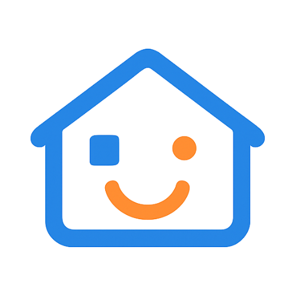

# Stay Mate

<div align="center">



**Ứng dụng quản lý thuê trọ dành cho người thuê**

[](https://flutter.dev)
[](https://dart.dev)
[](https://supabase.com)
[](LICENSE)

**[🇻🇳 Tiếng Việt](#)** • **[🇬🇧 English](README.md)**

</div>

---

## 📱 Giới thiệu

Stay Mate là ứng dụng quản lý thuê trọ được thiết kế dành riêng cho người thuê. Ứng dụng giúp bạn quản lý hợp đồng thuê, theo dõi hóa đơn, báo cáo sự cố và giao tiếp với chủ nhà một cách dễ dàng.

## ✨ Tính năng chính

- 🏠 **Trang chủ**: Tổng quan nhanh về hợp đồng, hóa đơn sắp đến và các sự cố bảo trì
- 📄 **Hợp đồng**: Xem danh sách hợp đồng, trạng thái ký kết và chi tiết (tiền thuê, đặt cọc, chu kỳ thanh toán, tệp đính kèm)
- 💰 **Hóa đơn**: Xem hóa đơn, chi tiết từng khoản, trạng thái thanh toán và hướng dẫn chuyển khoản ngân hàng
- 🛠️ **Báo cáo**: Tạo/gửi báo cáo bảo trì kèm hình ảnh, theo dõi tiến độ và xem lịch sử
- 💬 **Chat**: Nhắn tin real-time với chủ nhà
- 👤 **Hồ sơ**: Thông tin cá nhân, cài đặt tài khoản, chọn ngôn ngữ (VI/EN), và thông tin ứng dụng

## 🚀 Bắt đầu

### Yêu cầu

- Flutter SDK 3.x trở lên
- Dart 3.x trở lên
- Android Studio / VS Code với Flutter extensions
- Supabase account (cho backend)

### Cài đặt

```bash
# Clone repository
git clone https://github.com/kh-thien/staymate-mobile-app.git
cd staymate-mobile-app

# Cài đặt dependencies
flutter pub get

# Chạy ứng dụng
flutter run
```

### Cấu hình

1. Tạo file `.env` trong thư mục root:
```env
SUPABASE_URL=your_supabase_url
SUPABASE_ANON_KEY=your_supabase_anon_key
```

2. Cấu hình Firebase (cho notifications):
   - Thêm `google-services.json` (Android) vào `android/app/`
   - Thêm `GoogleService-Info.plist` (iOS) vào `ios/Runner/`

## 🏗️ Kiến trúc

Ứng dụng sử dụng Clean Architecture với các layer:

- **Presentation**: UI, Widgets, BLoC/Riverpod
- **Domain**: Entities, Use Cases, Repositories (interfaces)
- **Data**: Models, Data Sources, Repository implementations

## 📦 Dependencies chính

- `flutter_bloc` / `riverpod` - State management
- `supabase_flutter` - Backend & Authentication
- `go_router` - Navigation
- `freezed` - Immutable data classes
- `flutter_hooks` - React-like hooks
- `firebase_messaging` - Push notifications

## 🌐 Đa ngôn ngữ

Ứng dụng hỗ trợ 2 ngôn ngữ:
- 🇻🇳 Tiếng Việt
- 🇬🇧 English

Người dùng có thể chuyển đổi ngôn ngữ trong Settings > Language.

## 📄 License

MIT License - xem file [LICENSE](LICENSE) để biết thêm chi tiết.

## 👥 Đóng góp

Mọi đóng góp đều được chào đón! Vui lòng tạo Pull Request hoặc Issue.

## 📧 Liên hệ

- Email: staymate.home@gmail.com
- Privacy Policy: [https://kh-thien.github.io/privacy-policy-staymate-mobile-app/](https://kh-thien.github.io/privacy-policy-staymate-mobile-app/)
- Terms of Service: [https://kh-thien.github.io/terms-of-service-staymate/](https://kh-thien.github.io/terms-of-service-staymate/)

---

<div align="center">

Made with ❤️ by [Khac Thien Nguyen](https://github.com/kh-thien)

**[🇬🇧 Read in English](README.md)**

</div>

