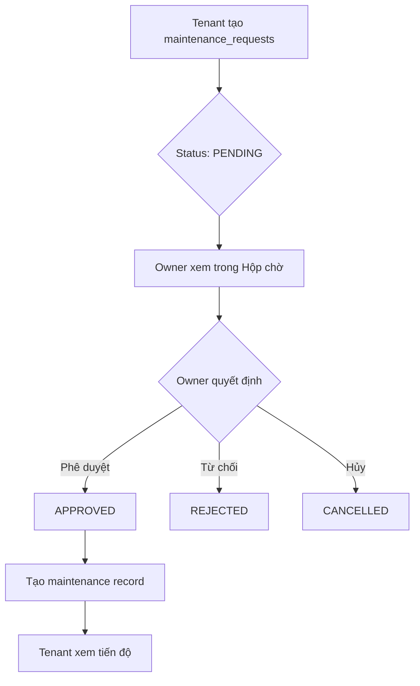
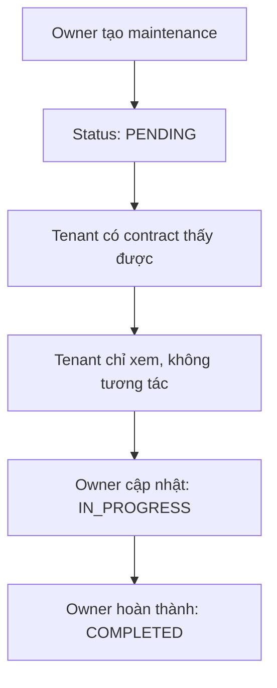

# Logic Quản lý Bảo trì - 2 Bảng System

## 📊 Tổng quan 2 bảng

### **Bảng `maintenance_requests`**
- **Mục đích**: Yêu cầu báo cáo sự cố từ tenant
- **Người tạo**: Tenant (người thuê)
- **Trạng thái**: PENDING → APPROVED/REJECTED/CANCELLED
- **Quyền hạn**: 
  - Tenant: Xem, Hủy, Xóa (chỉ của mình)
  - Owner: Xem, Phê duyệt/Từ chối/Hủy (KHÔNG xóa)

### **Bảng `maintenance`**
- **Mục đích**: Công việc bảo trì thực tế
- **Người tạo**: Owner (chủ nhà) hoặc từ APPROVED request
- **Trạng thái**: PENDING → IN_PROGRESS → COMPLETED/CANCELLED
- **Quyền hạn**:
  - Tenant: Chỉ xem (read-only), KHÔNG thấy CANCELLED
  - Owner: Full control (CRUD)

### **Liên kết 2 bảng**
```sql
maintenance.maintenance_request_id → maintenance_requests.id
```

---

## 🔄 Flow Logic

### **Case 1: Tenant tạo yêu cầu báo cáo sự cố**



**Quyền hạn:**

| Hành động | Tenant | Owner | Ghi chú |
|-----------|--------|-------|---------|
| Xem request | ✅ (của mình) | ✅ (của properties) | |
| Hủy request | ✅ | ✅ | Status → CANCELLED |
| Xóa request | ✅ | ❌ | Chỉ tenant tạo mới xóa được |
| Phê duyệt | ❌ | ✅ | Tạo maintenance record |
| Từ chối | ❌ | ✅ | Status → REJECTED |

**Code:**
```javascript
// Tenant hủy request của mình
await maintenanceService.cancelMaintenanceRequest(requestId);

// Owner phê duyệt → Tạo maintenance
await maintenanceService.approveMaintenanceRequest(requestId, {
  priority: "MEDIUM",
  maintenance_type: "OTHER"
});

// Owner từ chối
await maintenanceService.rejectMaintenanceRequest(requestId);
```

---

### **Case 2: Owner tự tạo công việc bảo trì**



**Quyền hạn:**

| Hành động | Tenant | Owner | Ghi chú |
|-----------|--------|-------|---------|
| Xem maintenance | ✅ (read-only) | ✅ | Tenant chỉ xem properties họ thuê |
| Tạo maintenance | ❌ | ✅ | |
| Cập nhật status | ❌ | ✅ | PENDING → IN_PROGRESS → COMPLETED |
| Xóa maintenance | ❌ | ✅ | |
| Comment/Note | ❌ | ✅ | Tenant không được thêm notes |

**Điều kiện tenant thấy:**
- Có contract ACTIVE với property
- Status KHÔNG PHẢI CANCELLED
- `deleted_at IS NULL`

**Code:**
```javascript
// Owner tạo maintenance
await maintenanceService.createMaintenanceRequest({
  property_id: "...",
  room_id: "...",
  title: "Bảo trì định kỳ",
  description: "Kiểm tra hệ thống điện",
  maintenance_type: "BUILDING",
  priority: "MEDIUM"
});
```

---

### **Case 3: Request được APPROVED → Chuyển sang maintenance**

**Flow:**
```
maintenance_requests (PENDING)
         ↓
    [Owner Approve]
         ↓
maintenance_requests (APPROVED)
         +
    maintenance (PENDING) ← Link với maintenance_request_id
         ↓
    [Owner: IN_PROGRESS]
         ↓
    [Owner: COMPLETED]
```

**Tenant thấy gì:**

**Trong `maintenance_requests`:**
```
✅ Status: APPROVED
📋 Yêu cầu đã được phê duyệt
🔗 Xem tiến độ xử lý → Link to maintenance
```

**Trong `maintenance`:**
```
🔧 Công việc: "Sửa chữa từ yêu cầu của bạn"
📊 Trạng thái: IN_PROGRESS (Đang xử lý)
⏱️ Tiến độ: 50%
📅 Bắt đầu: 01/11/2025
👁️ Chỉ xem, không tương tác
```

**Database:**
```sql
-- maintenance_requests
id: req-001
status: APPROVED
reported_by: tenant-user-id

-- maintenance
id: main-001
maintenance_request_id: req-001  ← Link
status: IN_PROGRESS
user_report_id: tenant-user-id   ← Track tenant
```

**Code implementation:**
```javascript
// In maintenanceService.js
async approveMaintenanceRequest(requestId, additionalData = {}) {
  // 1. Update request status
  await supabase
    .from("maintenance_requests")
    .update({ maintenance_requests_status: "APPROVED" })
    .eq("id", requestId);

  // 2. Create maintenance record
  const maintenance = await supabase
    .from("maintenance")
    .insert({
      property_id: request.properties_id,
      description: request.description,
      url_image: request.url_report,
      maintenance_request_id: requestId, // ← Link
      user_report_id: request.reported_by, // ← Track
      status: "PENDING",
      ...additionalData
    });

  return maintenance;
}
```

---

### **Case 4: Maintenance CANCELLED**

**Quy tắc:**

| Đối tượng | Hiển thị | Lý do |
|-----------|----------|-------|
| Tenant | ❌ KHÔNG | Để tránh nhầm lẫn, tenant không thấy công việc đã hủy |
| Owner | ✅ CÓ | Owner cần tracking history |

**Nếu maintenance link với request:**
```javascript
// Cancel maintenance + Update linked request
async cancelMaintenanceAndUpdateRequest(maintenanceId) {
  // 1. Update maintenance
  await supabase
    .from("maintenance")
    .update({ status: "CANCELLED" })
    .eq("id", maintenanceId);

  // 2. If linked to request, update request too
  const maintenance = await getMaintenanceById(maintenanceId);
  if (maintenance.maintenance_request_id) {
    await supabase
      .from("maintenance_requests")
      .update({ maintenance_requests_status: "CANCELLED" })
      .eq("id", maintenance.maintenance_request_id);
  }
}
```

**Tenant sẽ thấy:**
```
Trong maintenance_requests:
❌ Status: CANCELLED
📝 Yêu cầu đã bị hủy
⚠️ Không còn được xử lý
```

---

## 🔐 Application-Level Security

**⚠️ Lưu ý**: RLS đã disable, dùng application-level filtering.

### **Tenant Access Rules:**

**`maintenance_requests`:**
```javascript
// Chỉ xem requests của mình
.eq("reported_by", user.id)

// Chỉ update/delete requests của mình + status PENDING/REJECTED
.eq("reported_by", user.id)
.in("maintenance_requests_status", ["PENDING", "REJECTED"])
```

**`maintenance`:**
```javascript
// Chỉ xem maintenance của properties đang thuê
// Không thấy CANCELLED
const contracts = await getActiveContracts(user.id);
const propertyIds = contracts.map(c => c.property_id);

await supabase
  .from("maintenance")
  .select("*")
  .in("property_id", propertyIds)
  .neq("status", "CANCELLED")  // ← Hide CANCELLED
```

### **Owner Access Rules:**

**`maintenance_requests`:**
```javascript
// Xem requests của properties mình sở hữu
const properties = await getOwnedProperties(user.id);
const propertyIds = properties.map(p => p.id);

await supabase
  .from("maintenance_requests")
  .select("*")
  .in("properties_id", propertyIds)
```

**`maintenance`:**
```javascript
// Full access maintenance của properties mình sở hữu
await supabase
  .from("maintenance")
  .select("*")
  .in("property_id", propertyIds)
```

---

## 📱 UI/UX Implementation

### **Admin Web - Hộp chờ:**

```jsx
// PendingMaintenanceQueue.jsx
const { pendingRequests, approveRequest, rejectRequest, cancelRequest } = 
  usePendingMaintenance();

// Phê duyệt → Tạo maintenance
<button onClick={() => approveRequest(requestId, {
  priority: "MEDIUM",
  maintenance_type: "OTHER"
})}>
  ✅ Phê duyệt
</button>

// Từ chối
<button onClick={() => rejectRequest(requestId)}>
  ❌ Từ chối
</button>

// Hủy
<button onClick={() => cancelRequest(requestId)}>
  🚫 Hủy
</button>
```

### **Admin Web - Kanban Board:**

```jsx
// maintenance.jsx
<MaintenanceKanban
  maintenanceRequests={maintenanceRequests}
  onStatusChange={updateMaintenanceStatus}
/>

// Show icon if linked to request
{maintenance.maintenance_request_id && (
  <Badge>👤 Từ tenant</Badge>
)}
```

### **Mobile App - Tenant:**

**Tab "Báo cáo sự cố":**
```jsx
// maintenance_requests list
{requests.map(req => (
  <RequestCard
    status={req.maintenance_requests_status}
    canCancel={req.maintenance_requests_status === 'PENDING'}
    canDelete={req.reported_by === currentUser.id}
    linkedMaintenanceId={req.linked_maintenance?.id}
  />
))}
```

**Tab "Bảo trì":**
```jsx
// maintenance list (read-only for tenant)
{maintenances
  .filter(m => m.status !== 'CANCELLED')  // Hide CANCELLED
  .map(m => (
    <MaintenanceCard
      readOnly={true}
      showOriginBadge={m.user_report_id === currentUser.id}
    />
  ))}
```

---

## 🧪 Test Cases

### **Test Case 1: Tenant tạo request → Owner approve**
```javascript
// 1. Tenant tạo request
const request = await createRequest(tenantUserId, {
  properties_id: property.id,
  description: "Vỡ sân"
});
expect(request.maintenance_requests_status).toBe("PENDING");

// 2. Owner approve
const maintenance = await approveRequest(request.id);
expect(maintenance.maintenance_request_id).toBe(request.id);
expect(maintenance.status).toBe("PENDING");

// 3. Check request updated
const updatedRequest = await getRequest(request.id);
expect(updatedRequest.maintenance_requests_status).toBe("APPROVED");
```

### **Test Case 2: Tenant không thấy CANCELLED maintenance**
```javascript
// 1. Owner tạo maintenance
const maintenance = await createMaintenance(ownerId, {
  property_id: property.id,
  status: "PENDING"
});

// 2. Tenant thấy
let tenantView = await getMaintenanceAsT tenant(tenantUserId);
expect(tenantView).toContain(maintenance.id);

// 3. Owner cancel
await updateStatus(maintenance.id, "CANCELLED");

// 4. Tenant KHÔNG thấy
tenantView = await getMaintenanceAsTenant(tenantUserId);
expect(tenantView).not.toContain(maintenance.id);
```

### **Test Case 3: Tenant không xóa được request của người khác**
```javascript
// 1. Tenant A tạo request
const request = await createRequest(tenantA.id, {...});

// 2. Tenant B cố xóa → FAIL
await expect(
  deleteRequest(request.id, tenantB.id)
).rejects.toThrow("Access denied");

// 3. Owner cố xóa → FAIL
await expect(
  deleteRequest(request.id, owner.id)
).rejects.toThrow("Cannot delete tenant's request");
```

---

## 📝 Summary

### **Logic Hợp lý ✅**
- ✅ Phân quyền rõ ràng
- ✅ Flow APPROVED tạo maintenance tự động
- ✅ Tenant read-only maintenance
- ✅ CANCELLED ẩn với tenant
- ✅ Link 2 bảng để tracking

### **Implementation Complete ✅**
- ✅ Database: Thêm `maintenance_request_id` column
- ✅ Service: `approveMaintenanceRequest()`, `rejectMaintenanceRequest()`, `cancelMaintenanceRequest()`
- ✅ Hook: `usePendingMaintenance` với 3 actions
- ✅ Component: `PendingMaintenanceQueue` với 3 buttons
- ✅ Security: Application-level filtering

### **Next Steps 📋**
- [ ] Test trên mobile app
- [ ] Thêm notification khi approve/reject
- [ ] UI hiển thị link giữa request ↔ maintenance
- [ ] Analytics: Track approval rate, response time
